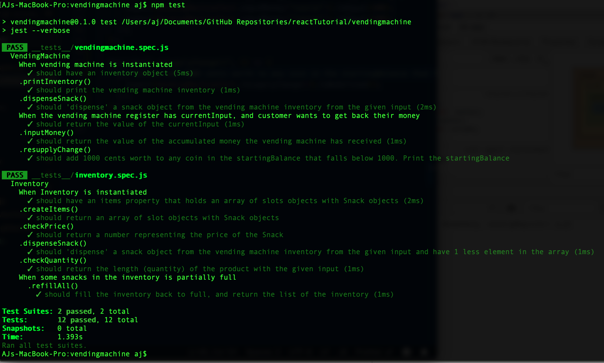

## Vending Machine

The purpose of this repository is to practice TDD using Jest
The goal is to create a vending machine that can print its inventory, accept coins, dispense and item, give change, resupply

### npm test

To run the test in the terminal

